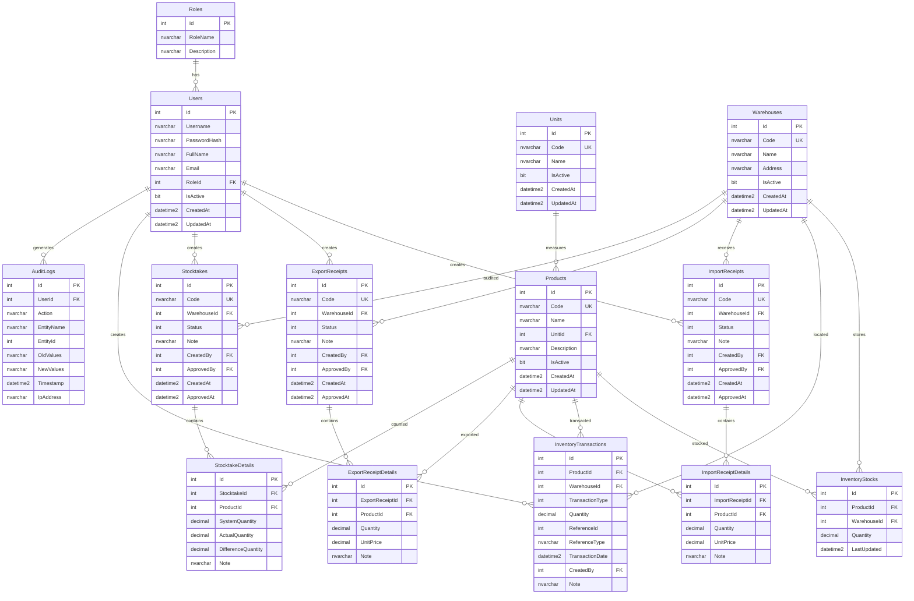

# ERD — ERP KHO (KAN-2103)

```mermaid
erDiagram
    Roles {
        int Id PK
        nvarchar RoleName
        nvarchar Description
    }

    Users {
        int Id PK
        nvarchar Username
        nvarchar PasswordHash
        nvarchar FullName
        nvarchar Email
        int RoleId FK
        bit IsActive
        datetime2 CreatedAt
        datetime2 UpdatedAt
    }

    Units {
        int Id PK
        nvarchar Code UK
        nvarchar Name
        bit IsActive
        datetime2 CreatedAt
        datetime2 UpdatedAt
    }

    Products {
        int Id PK
        nvarchar Code UK
        nvarchar Name
        int UnitId FK
        nvarchar Description
        bit IsActive
        datetime2 CreatedAt
        datetime2 UpdatedAt
    }

    Warehouses {
        int Id PK
        nvarchar Code UK
        nvarchar Name
        nvarchar Address
        bit IsActive
        datetime2 CreatedAt
        datetime2 UpdatedAt
    }

    InventoryStocks {
        int Id PK
        int ProductId FK
        int WarehouseId FK
        decimal Quantity
        datetime2 LastUpdated
    }

    InventoryTransactions {
        int Id PK
        int ProductId FK
        int WarehouseId FK
        int TransactionType
        decimal Quantity
        int ReferenceId
        nvarchar ReferenceType
        datetime2 TransactionDate
        int CreatedBy FK
        nvarchar Note
    }

    ImportReceipts {
        int Id PK
        nvarchar Code UK
        int WarehouseId FK
        int Status
        nvarchar Note
        int CreatedBy FK
        int ApprovedBy FK
        datetime2 CreatedAt
        datetime2 ApprovedAt
    }

    ImportReceiptDetails {
        int Id PK
        int ImportReceiptId FK
        int ProductId FK
        decimal Quantity
        decimal UnitPrice
        nvarchar Note
    }

    ExportReceipts {
        int Id PK
        nvarchar Code UK
        int WarehouseId FK
        int Status
        nvarchar Note
        int CreatedBy FK
        int ApprovedBy FK
        datetime2 CreatedAt
        datetime2 ApprovedAt
    }

    ExportReceiptDetails {
        int Id PK
        int ExportReceiptId FK
        int ProductId FK
        decimal Quantity
        decimal UnitPrice
        nvarchar Note
    }

    Stocktakes {
        int Id PK
        nvarchar Code UK
        int WarehouseId FK
        int Status
        nvarchar Note
        int CreatedBy FK
        int ApprovedBy FK
        datetime2 CreatedAt
        datetime2 ApprovedAt
    }

    StocktakeDetails {
        int Id PK
        int StocktakeId FK
        int ProductId FK
        decimal SystemQuantity
        decimal ActualQuantity
        decimal DifferenceQuantity
        nvarchar Note
    }

    AuditLogs {
        int Id PK
        int UserId FK
        nvarchar Action
        nvarchar EntityName
        int EntityId
        nvarchar OldValues
        nvarchar NewValues
        datetime2 Timestamp
        nvarchar IpAddress
    }

    Roles ||--o{ Users : "has"
    Users ||--o{ ImportReceipts : "creates"
    Users ||--o{ ExportReceipts : "creates"
    Users ||--o{ Stocktakes : "creates"
    Users ||--o{ InventoryTransactions : "creates"
    Users ||--o{ AuditLogs : "generates"

    Units ||--o{ Products : "measures"

    Products ||--o{ InventoryStocks : "stocked"
    Products ||--o{ InventoryTransactions : "transacted"
    Products ||--o{ ImportReceiptDetails : "imported"
    Products ||--o{ ExportReceiptDetails : "exported"
    Products ||--o{ StocktakeDetails : "counted"

    Warehouses ||--o{ InventoryStocks : "stores"
    Warehouses ||--o{ InventoryTransactions : "located"
    Warehouses ||--o{ ImportReceipts : "receives"
    Warehouses ||--o{ ExportReceipts : "dispatches"
    Warehouses ||--o{ Stocktakes : "audited"

    ImportReceipts ||--o{ ImportReceiptDetails : "contains"
    ExportReceipts ||--o{ ExportReceiptDetails : "contains"
    Stocktakes ||--o{ StocktakeDetails : "contains"
```
